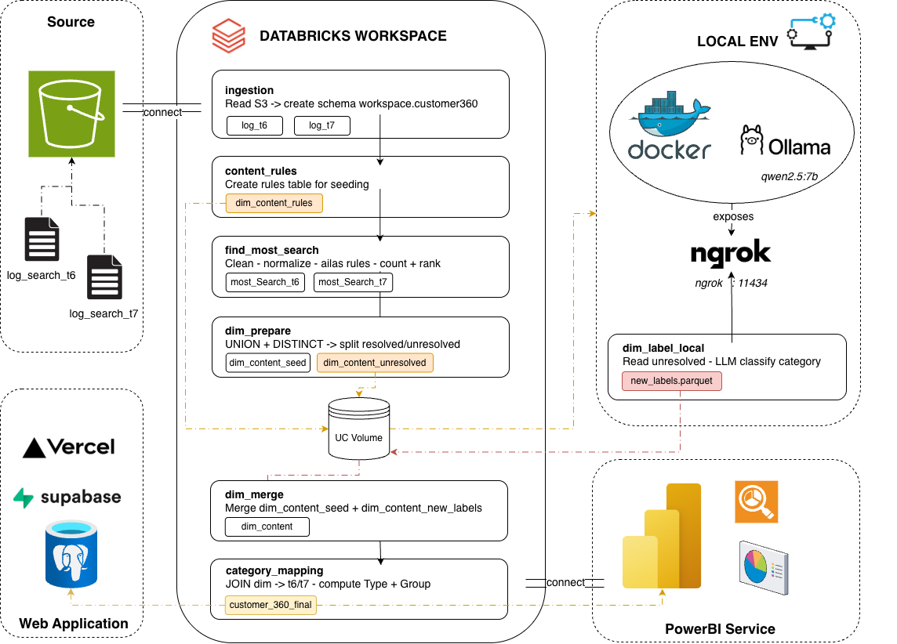
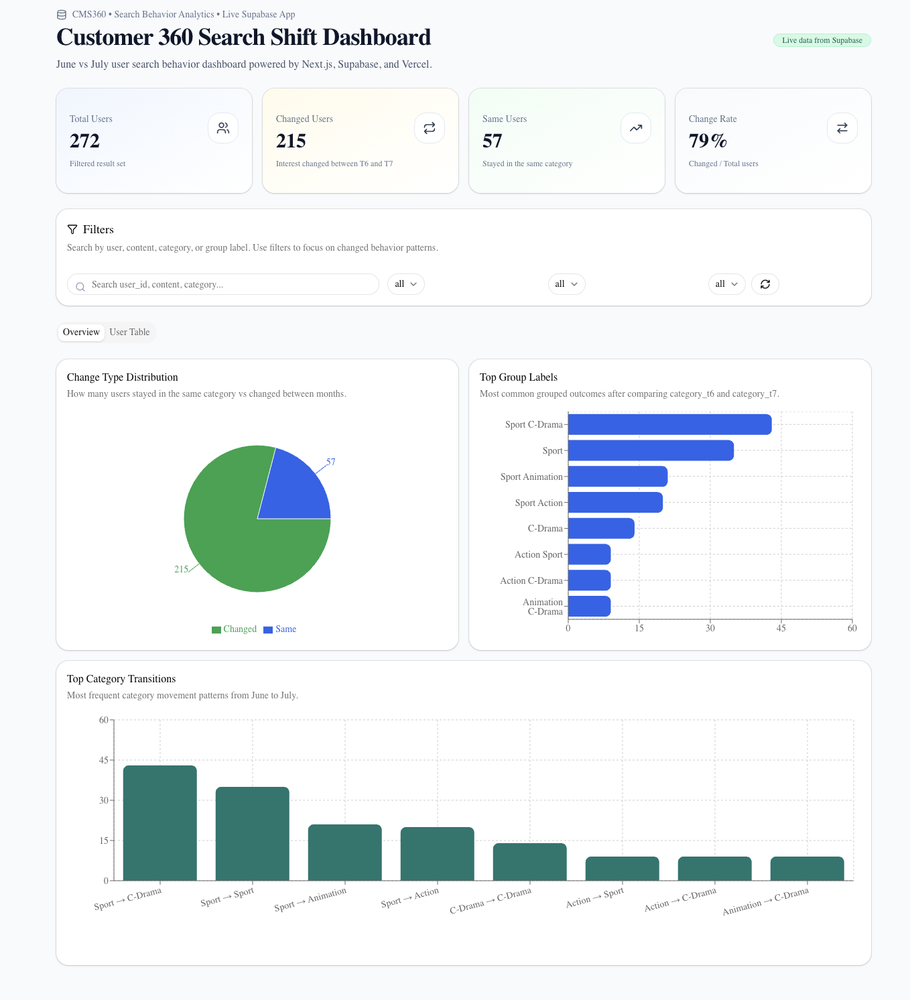

# CMS360 – Customer Search Behavior Analytics Platform

## 1. Project Overview

This is an end-to-end Customer 360 analytics project designed to analyze **search behavior changes across time**.  
The system processes search logs from two different months, identifies each user’s most searched content, classifies content into business categories, and compares category shifts between months.

The project demonstrates a **realistic data engineering + analytics architecture**, including batch processing, dimensional modeling, web application serving, and BI reporting.

---

## 2. Business Problem

From a business perspective, this project answers questions such as:

- What content categories are users most interested in?
- Do users maintain the same interests over time or shift to different categories?
- How many users change their content preferences month over month?
- How can this information be used for segmentation, recommendation, or CRM strategies?

---

## 3. Demo Scope

This project is intentionally scoped for portfolio demonstration:

- Two monthly search log datasets (June & July)
- One snapshot day per month (demo scale)
- Each user → **one most searched content per month**
- Content classified into **one business category**
- Final output at **user level** for analytics and visualization

---

## 4. Tech Stack

### Data Engineering
- **AWS S3** – raw log storage
- **Databricks + PySpark** – ingestion, ETL, transformation
- **Delta / Unity Catalog** – table management

### Serving & Application
- **Supabase (PostgreSQL)** – serving layer
- **Next.js (App Router)** – web application
- **Vercel** – deployment

### Analytics & BI
- **Power BI Service** – dashboards and reporting

---

## 5. Architecture

### Architecture Explanation

- Raw search logs are stored in S3
- Databricks processes logs to:
  - clean search keywords
  - compute most searched content per user
  - build a content dimension
- Content is categorized using a **rules-first + LLM fallback** approach
- Final dataset is written to:
  - **Supabase** for web application serving
  - **Databricks** for BI analytics
- Two consumption layers:
  - Web App (Next.js + Supabase)
  - Power BI Dashboard (Databricks source)

---

## 6. Data Pipeline Breakdown

### 6.1 Ingestion
- Raw search logs (June & July) are ingested from S3 into Databricks tables.

### 6.2 ETL – Most Search per User
- Clean and normalize search keywords
- Apply alias rules (optional)
- Count search frequency by `user_id`
- Deterministic ranking
- Select top searched content per user per month

Output:
- `most_search_t6`
- `most_search_t7`

---

### 6.3 Content Dimension & Categorization
- Union distinct content from June and July
- Apply exact rule-based mapping first
- Unresolved content is classified using a local LLM (Ollama)
- Final dimension table: `dim_content`
  - content
  - canonical_content
  - category
  
---

### 6.4 Customer 360 Comparison
- Join content dimension back to monthly results
- Compute:
  - `category_t6`
  - `category_t7`
  - `change_type` (Same/Changed)
  - `group_label`
- Final table: `customer_360_final`

---

## 7. Web Application

### Live Demo

### Features
- KPI cards (total users, changed users, change rate)
- Filtes by category, froup, change type
- Category transition charts
- User-level drill-down view

---

## 8. BI Dashboard

### Key Metrics:
- Total Users
- Change Rate (%)
- Changed vs Same users
- Category transition maatrix

---

## 9. Project Structure

